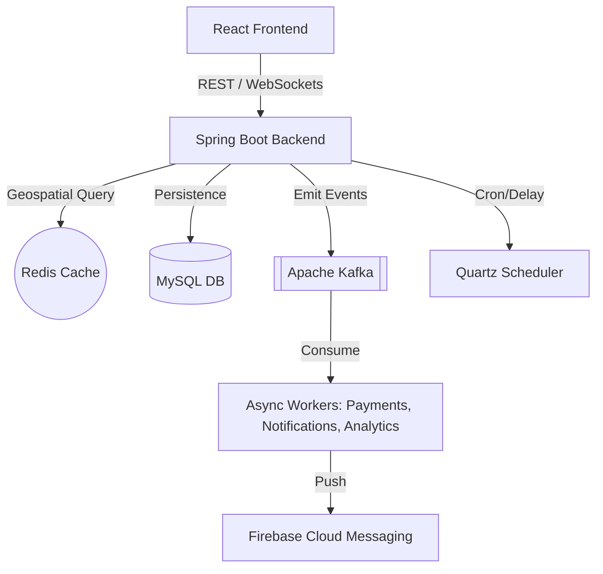

# RideConnect: Scalable Ride-Sharing Ecosystem

[](https://spring.io/projects/spring-boot)
[](https://reactjs.org/)
[](https://github.com/)

**RideConnect** is a professional-grade, distributed ride-sharing platform built to demonstrate high-concurrency architecture. It features real-time driver tracking, geospatial matching, and an event-driven backend.

---

## 🏗️ Technical Architecture

The system is designed for high scalability, moving beyond a simple CRUD application into a distributed mesh:



### Core Scalability Pillars:
- **Real-Time Strategy**: Uses WebSockets (STOMP) for live ride updates and driver GPS streaming.
- **Geospatial Matching**: Leverages Redis `GEO` commands for sub-100ms driver discovery instead of heavy SQL proximity joins.
- **Event-Driven Workflows**: Post-ride operations (earnings, analytics, notifications) are decoupled via Kafka to maintain low API latency.
- **Resiliency**: Implements Dead Letter Queues (DLQ) and Bucket4j distributed rate limiting for system protection.
- **Prototype Mode**: Backend includes "Feature Toggles" to disable Kafka/Redis/Firebase for a minimal local demo (MySQL only).

---

## ✨ Features

- **Ride Lifecycle**: Real-time status transitions (Requested → Accepted → Started → Completed).
- **Tracking**: Live vehicle movement on Google Maps.
- **Security**: JWT-based authentication with Tiered Rate Limiting.
- **Scheduling**: Persistent background job scheduling for future rides using Quartz.
- **Payments**: Integrated Stripe flow with idempotent webhook processing.
- **Notifications**: Multi-channel alerts (WebSockets + Firebase Push).

---

## 🚀 Local Setup (Prototype Mode)

To run this project as a student prototype without setting up the full Kafka/Redis/Firebase infrastructure, use the **Prototype Flags**.

### 1. Prerequisites
- **Java 21**
- **Node.js 18+**
- **MySQL 8.x**

### 2. Backend Setup (Spring Boot)
1. **Navigate to backend**:
   ```bash
   cd ridesharing
   ```
2. **Setup Database**:
   Create a database named `ridesharing_db` in MySQL.
3. **Configure Properties**:
   Edit `src/main/resources/application.properties`:
   ```properties
   # Disable external services for local prototype demo
   app.feature.redis.enabled=false
   app.feature.kafka.enabled=false
   app.feature.firebase.enabled=false
   ```
4. **Run Application**:
   ```bash
   ./mvnw spring-boot:run
   ```

### 3. Frontend Setup (React)
1. **Navigate to frontend**:
   ```bash
   cd Forntend/RideSharing
   ```
2. **Install & Run**:
   ```bash
   npm install
   npm run dev
   ```

---

## 📡 API Documentation (Sample)

| Endpoint | Method | Description |
| :------- | :----- | :---------- |
| `/api/auth/register` | `POST` | Create new Rider/Driver account |
| `/api/rides` | `POST` | Request a new ride |
| `/api/rides/{id}/accept` | `POST` | Driver accepts the ride |
| `/api/rides/{id}/complete` | `POST` | Finalize ride and trigger payment |

---

## 📂 Repository Structure

```text
RideSharingApp/
├── ridesharing/        # Spring Boot Application (Backend)
│   ├── src/            # Java Source & Resources
│   └── pom.xml         # Maven Config
├── Forntend/           # Frontend root
│   └── RideSharing/    # React Frontend (Vite)
├── docs/               # System architecture & Logic flows
└── tools/              # Postman Collections & Setup Scripts
```
## 🛠️ Tech Stack
- **Backend**: Spring Boot, Spring Security, Spring Data JPA, Kafka, Redis, Quartz.
- **Frontend**: React, TanStack Query, Socket.io-client, Google Maps API.
- **Database**: MySQL, Redis (Geospatial).
- **Cloud**: Firebase (FCM), Stripe (Payments).
